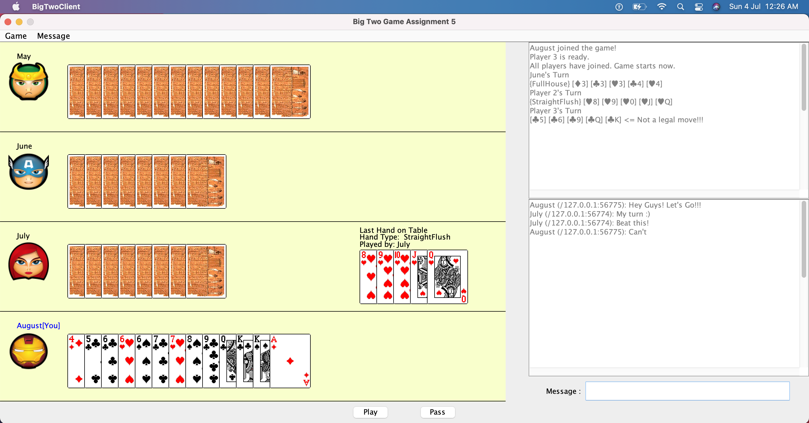
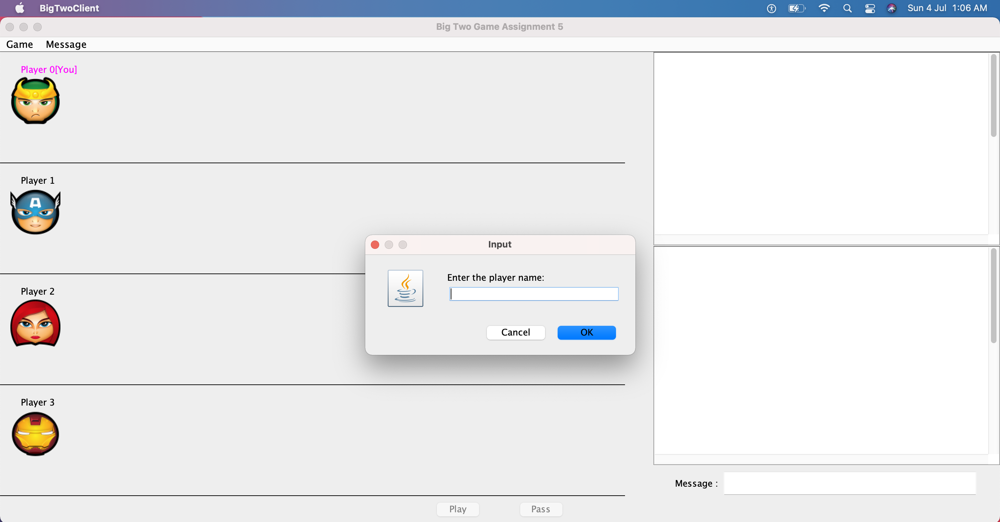
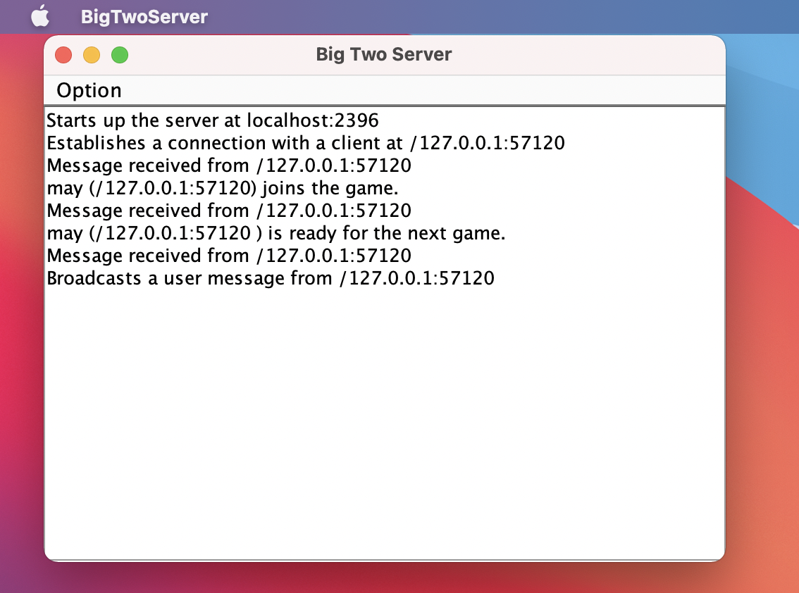
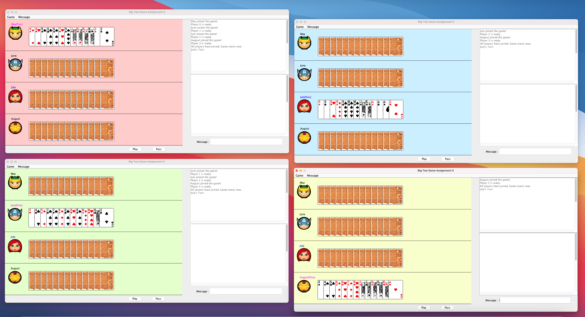

# Big Two Game

## Game Interface
 

## How to implement

#### A). Command Line Implementation (for MAC or windows)

I) Open the terminal/command prompt and traverse to the directory in which the game respository is located.
II) Run the following Commands

##### Compile the Source Code
``` 
cd sourcecode             
javac BigTwoClient.java
javac BigTwoServer.java
```

##### Start the server
``` 
java BigTwoServer 
```

##### Join as Client
``` 
java BigTwoClient
```

#### B). IDE implementation

Open the project in any IDE, compile the source code and run BigTwoServer and BigTwoClient.

On successfully running the program you can see the following server and client window.
 

 


Incase if you want to play from the same device, run the BigTwoClient numberous times.


 

## About the Game

Big Two is a popular game card game. You can learn more about the rules <a href='https://www.wikihow.com/Play-Big-Two'>here </a>

## Features of this projects

1. Multi-threading that handles multiple clients and implements chat option among players

2. Makes using of JAVA GUI (Swing Components)

3. Object Oriented Code
